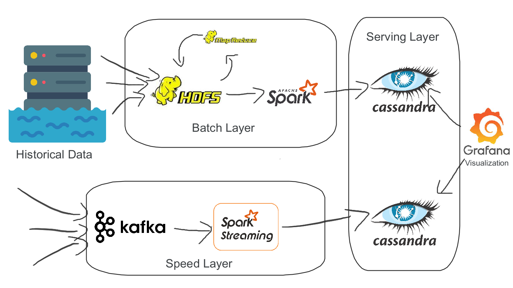

# Big data pipeline

This project is a big data pipeline designed to handle streaming
stock market data. It consists of two main components: 
batch processing using Hadoop MapReduce and stream processing
using Spark Streaming.
## Usage
### batch processing (Hadoop MapReduce)
* calculate min and max of closing price on historical data 
### stream processing (Spark Streaming)
* filtering high volume streaming stock market data and store it to cassandra 
* calculate daily range (high - low) and store to cassandra 

## Architecture

## Demo 
[Screencast from 10-05-23 23:51:35.webm](https://github.com/Driramohamedfarouk/bigdata-stock-market-pipeline/assets/79766774/55bd2198-4a56-45fc-908c-3816fb2f2d21)
